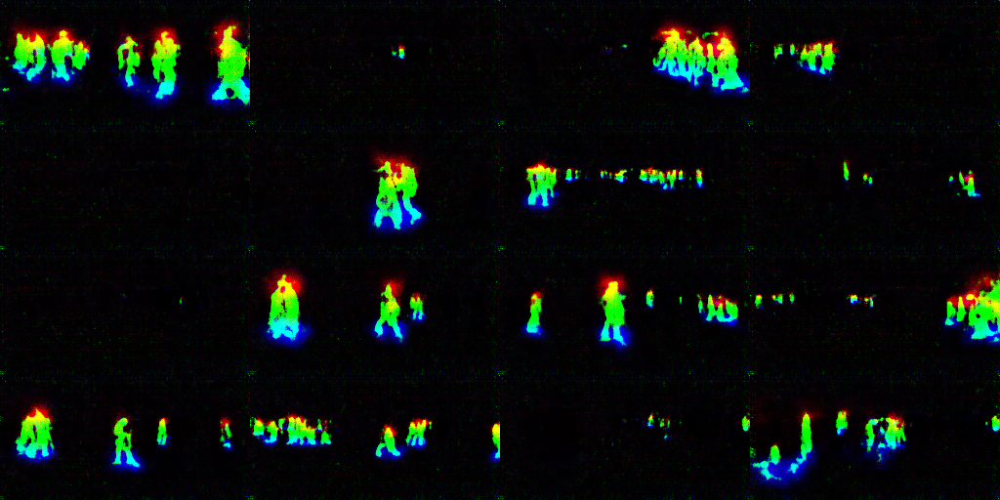
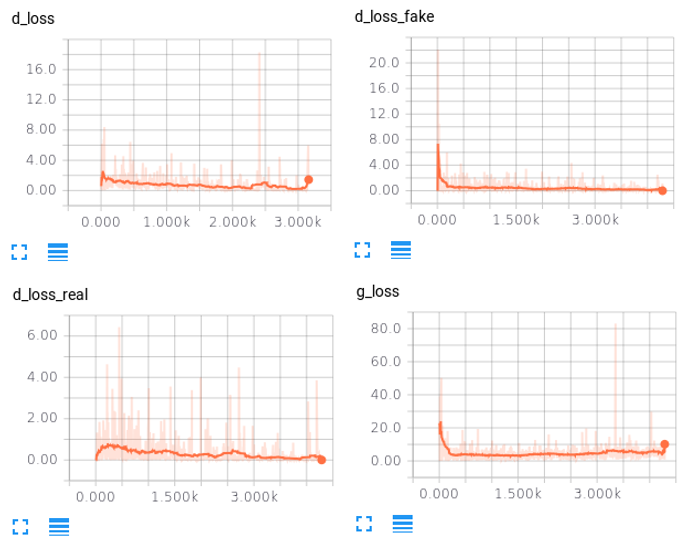
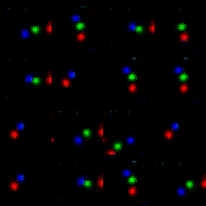
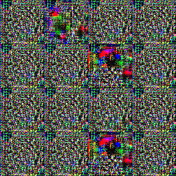
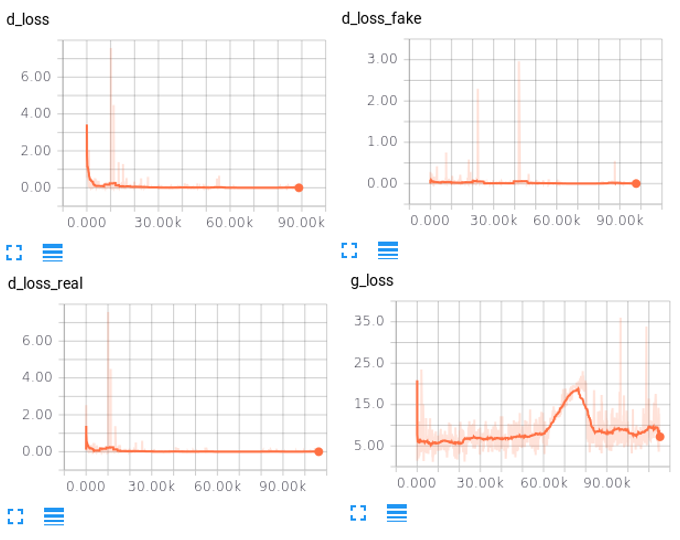
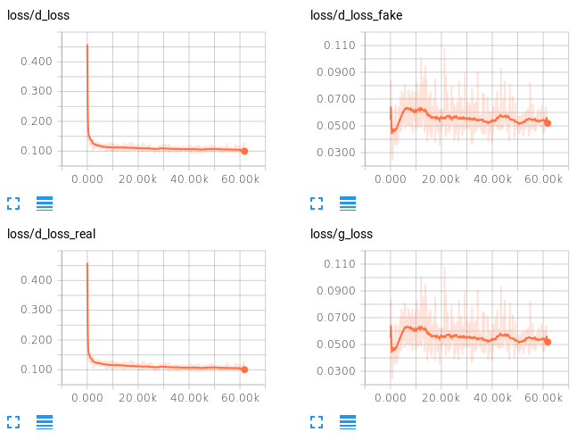
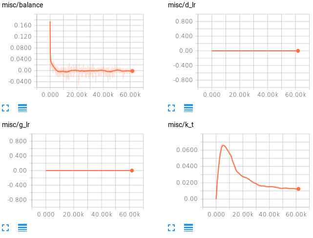
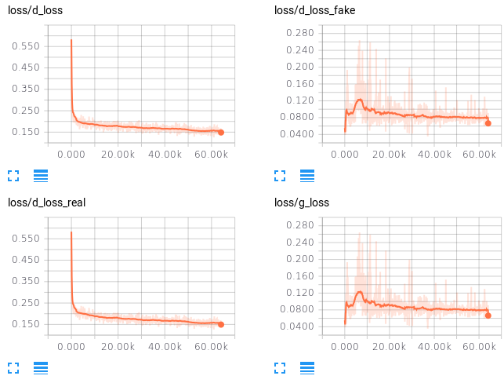
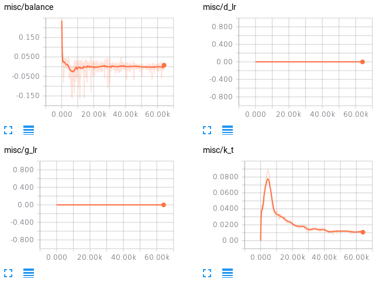
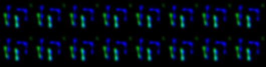

# Pose GAN

## Training note
- DCGAN
    - city, difficult to G (D memorize all images?)
    - lsp, difficult to D_real (images too wild, D can't recognize, G can't improve?)
- BEGAN    
    - higher gamma -> higher diversity
    - hard to reconstruct -> focus on real -> lower diversity
### DCGAN Record

- DCGAN_face    
    - **not yet converge?**
    - batch_size: 32
    - image_size: 218x178
    

- DCGAN_city
    - **low_diversity (6509 from 194 scenes)**
    - **g_loss can't converge, becuase similar scenes with slightly differences?**
    - batch_size: 32
    - image_size: 128x256
    

- DCGAN_city_coarse
    - **high_diversity (19998 scenes)**
    - **d_real is small, because view point is still similar?**
    - batch_size: 32
    - image_size: 256x256
    

- DCGAN_lsp
    - **wild high_diversity (11000 scenes)**
    - **too difficult for d_real?**
    - batch_size: 32
    - image_size: 256x256
    

- DCGAN_heatmap
    - **works! (6509 from 194 scenes)**
    - batch_size: 32
    - image_size: 128x256
    

- DCGAN_heatmap_joint
    - **accidentally collapse**
    - batch_size: 32
    - image_size: 64x64
    

### BEGAN Record

- BEGAN_face
    - **d_fake keep pulling over each other**
    - **results keep both diversity and realistic**
    - **balanced, k_t not going to zero!**
    - gamma = 0.5
    - d_lr = 0.00008
    - g_lr = 0.00008
    - lr_lower_boundary = 0.00002
    

- BEGAN_city
    - **low diversity result**
    - **loss vibrate slightly**
    - gamma = 0.5
    - d_lr = 0.00008
    - g_lr = 0.00008
    - lr_lower_boundary = 0.00002
    

- BEGAN_city_coarse
    - **thougt dataset has more diversity, results still are low diversity**
    - **loss vibrate tensely**
    - gamma = 0.5
    - d_lr = 0.00008
    - g_lr = 0.00008
    - lr_lower_boundary = 0.00002
    

- BEGAN_city_coarse_gamma
    - **higher gamma -> higher k_t -> focus d_fake -> d_fake larger 
    -> higher diversity results -> not very realistic**
    - **d_fake keep pulling over each other**
    - **gamma = 0.9**
    - d_lr = 0.00008
    - g_lr = 0.00008
    - lr_lower_boundary = 0.00002

- BEGAN_city_coarse_lr
    - **lower learning rate seems perform better**
    - **d_fake keep pulling over each other**
    - gamma = 0.5
    - **d_lr = 0.00004**
    - **g_lr = 0.00004**
    - lr_lower_boundary = 0.00002

- BEGAN_lsp
    - **almost same with city_coarse**
    - **thougt dataset has more diversity, results still are low diversity**
    - **loss vibrate tensely**
    - gamma = 0.5    
    - d_lr = 0.00008
    - g_lr = 0.00008
    - lr_lower_boundary = 0.00002

- BEGAN_lsp_gamma
    - **differ from city_coarse, the model seems to collapse**
    - **higher gamma -> higher k_t -> focus d_fake -> d_fake larger 
    -> higher diversity results -> not very realistic**
    - **gamma = 0.9** 
    - d_lr = 0.00008
    - g_lr = 0.00008
    - lr_lower_boundary = 0.00002
    

- BEGAN_lsp_lr
    - **lower learning rate seems perform better**
    - gamma = 0.5
    - **d_lr = 0.00004**
    - **g_lr = 0.00004**
    - lr_lower_boundary = 0.00002
    

- BEGAN_heatmap
    - **lower learning rate seems perform better**
    - gamma = 0.5
    - **d_lr = 0.00004**
    - **g_lr = 0.00004**
    - lr_lower_boundary = 0.00002
    

- BEGAN_heatmap_joint
    - **lower learning rate seems perform better**
    - gamma = 0.5
    - **d_lr = 0.00004**
    - **g_lr = 0.00004**
    - lr_lower_boundary = 0.00002
    

